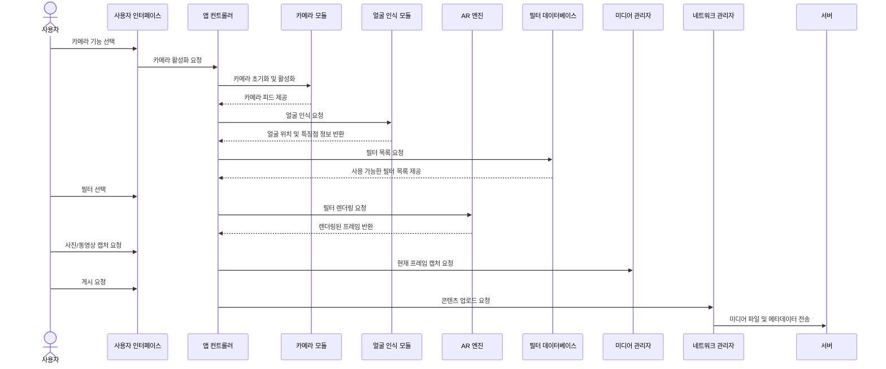

# Instagram AR Filter System

일상 속 소프트웨어 사용 사례를 기반으로 한 Instagram AR 필터 시스템의 시퀀스 다이어그램 및 구현체입니다.

## 📋 프로젝트 개요

이 프로젝트는 Instagram의 AR 필터 기능을 모델링하고 구현한 학술적 목적의 시뮬레이션입니다. 사용자가 카메라를 통해 실시간으로 AR 필터를 적용하고, 캡처하여 소셜 미디어에 공유하는 전체 과정을 다룹니다.

## 🎯 주요 기능

- **실시간 카메라 피드**: OpenCV를 활용한 카메라 제어
- **얼굴 인식**: 하르 캐스케이드를 이용한 얼굴 및 특징점 검출
- **AR 필터 적용**: 다양한 타입의 AR 필터 (강아지 귀, 빈티지, 뷰티, 무지개 안경)
- **미디어 캡처**: 필터 적용된 이미지 저장
- **소셜 미디어 업로드**: 시뮬레이션된 네트워크 업로드

## 📐 시스템 아키텍처

### 시퀀스 다이어그램


### 모듈 구조
```
├── models.py              # 데이터 모델 정의
├── camera_module.py       # 카메라 제어
├── face_detector.py       # 얼굴 인식
├── filter_database.py     # 필터 관리
├── ar_engine.py          # AR 렌더링
├── media_manager.py      # 미디어 캡처/관리
├── network_manager.py    # 네트워크 통신
├── app_controller.py     # 전체 시스템 조율
├── ui_simulator.py       # UI 시뮬레이션
└── main.py              # 메인 실행 파일
```

## 🚀 설치 및 실행

### 필수 요구사항
- Python 3.8+
- OpenCV
- NumPy

### 설치
```bash
# 저장소 클론
git clone https://github.com/kseojinn/instagram-ar-system.git
cd instagram-ar-system

# 가상환경 생성 (선택사항)
python -m venv venv
source venv/bin/activate  # Windows: venv\Scripts\activate

# 의존성 설치
pip install -r requirements.txt
```

### 실행
```bash
# 메인 프로그램 실행
python main.py

# 테스트 실행
python test_instagram_ar.py
```

## 📊 모듈 품질 평가

### 응집도 평가 (9/10)
- **기능적 응집도**: 각 모듈이 단일 책임을 명확히 수행
- **명확한 역할 분리**: Camera, FaceDetector, AREngine 등 각각 독립적 기능

### 결합도 평가 (8.5/10)
- **데이터 결합도**: 모듈 간 데이터 모델을 통한 통신
- **낮은 의존성**: AppController를 통한 느슨한 결합
- **개선점**: 설정 관리 모듈 분리 필요

### 전체 품질 (9/10)
**장점:**
- 명확한 책임 분리
- 확장 가능한 구조  
- 테스트 용이성
- 시퀀스 다이어그램과 높은 일치도

**개선점:**
- 에러 처리 강화
- 비동기 처리 구현
- 메모리 관리 최적화

## 🎮 사용법

1. **카메라 활성화**: 프로그램 실행 시 자동으로 카메라가 활성화됩니다
2. **필터 선택**: 터미널에 표시되는 필터 목록에서 원하는 필터를 선택합니다
3. **실시간 미리보기**: 선택한 필터가 실시간으로 적용되는 것을 확인할 수 있습니다
4. **캡처**: 마음에 드는 순간을 캡처합니다
5. **업로드**: 캡처된 이미지가 시뮬레이션된 서버로 업로드됩니다

## 🛠️ 기술 스택

- **Python 3.8+**: 메인 프로그래밍 언어
- **OpenCV**: 컴퓨터 비전 및 이미지 처리
- **NumPy**: 수치 연산
- **Mermaid**: 시퀀스 다이어그램 작성

## 🔧 구현 세부사항

### AR 필터 종류
1. **강아지 귀**: 얼굴 위에 귀여운 강아지 귀 추가
2. **빈티지 필름**: 세피아 톤의 빈티지 효과
3. **뷰티 보정**: 자연스러운 피부 보정 효과
4. **무지개 안경**: 다채로운 무지개 안경

### 얼굴 인식
- 하르 캐스케이드 분류기 사용
- 주요 특징점 검출 (눈, 코, 입)
- 실시간 처리 최적화

### 미디어 처리
- 실시간 프레임 캡처
- 로컬 저장소 관리
- 메타데이터 포함 업로드

## 📝 라이선스

이 프로젝트는 MIT 라이선스 하에 배포됩니다. 학술적 목적으로만 사용하시기 바랍니다.

## 👨‍💻 기여자

- **개발자**: Seojin Kang
- **과제 목적**: 소프트웨어 아키텍처 설계 및 구현

-
**주의**: 이 프로젝트는 교육용 시뮬레이션이며, 실제 Instagram과는 관련이 없습니다.
